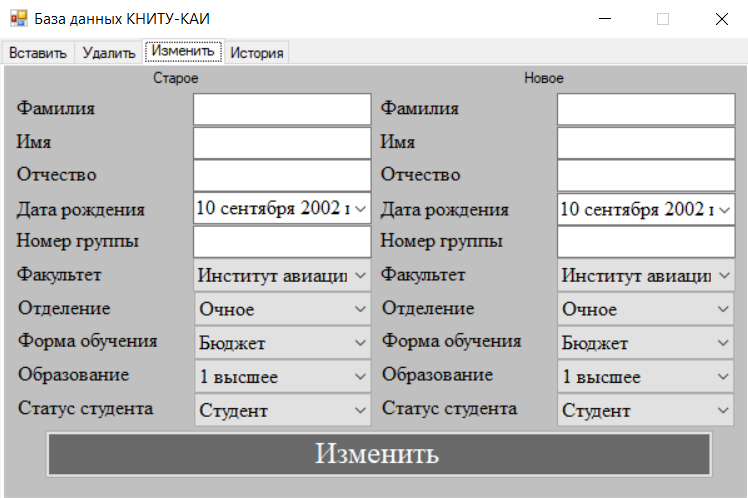
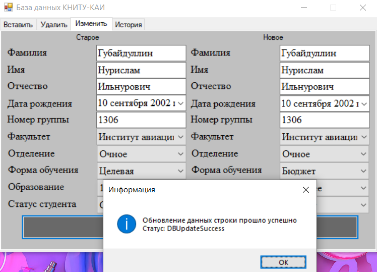

# LocalDBCSharp by tonitaga

## Основная идея

- Тестовое задание от КНИТУ-КАИ на должность Программиста
- Работа с локальной базой данных
- Реализация работы добавления, удаления, изменения данных в Базе Данных

## Как оно выглядит?

- Авторизация

    

- Успешная авторизация

    

- Неудачная авторизация

    

- Окно программы для добавления данных

    

- Окно программы для удаления данных

    

- Окно программы для изменения данных

    

- Окно программы для просмотра истории работы

    

## Работа программы

- Программа сама контролирует валидность данных и сравнивает входящие данные с данными таблиц в базе данных

    

    

    

    

    

    

#### © tonitaga (Нурислам Губайдуллин) 18.03.2023